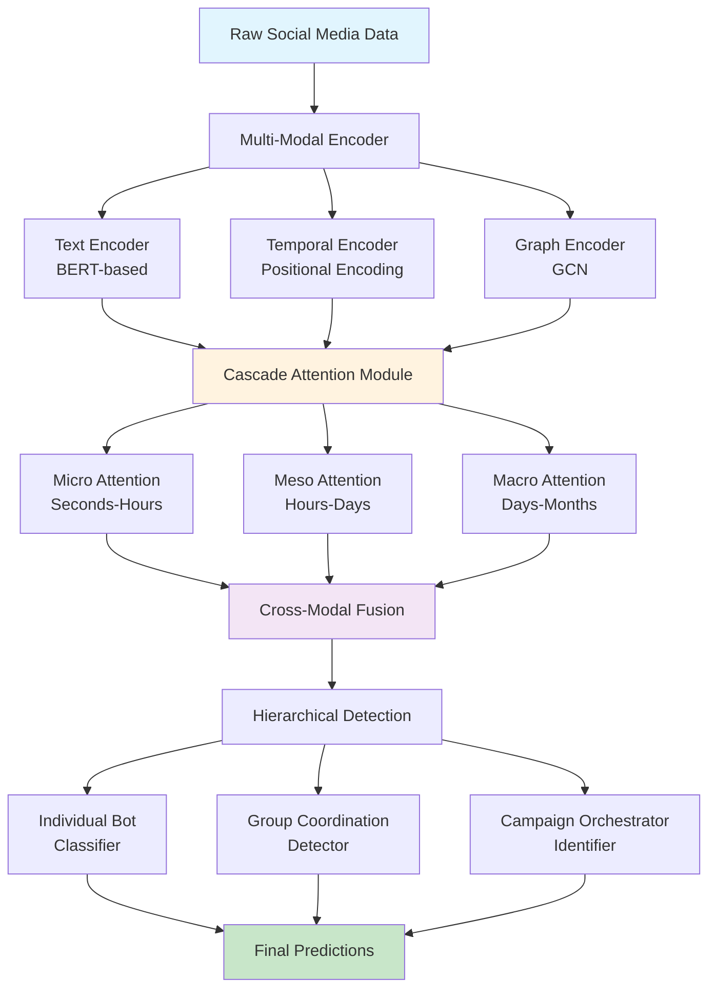
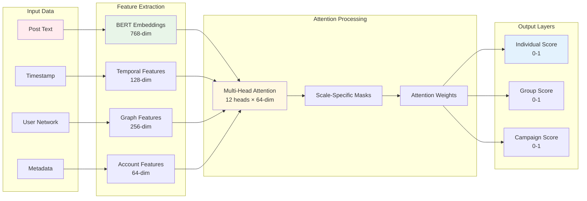
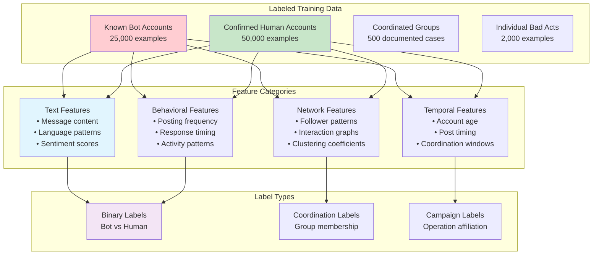
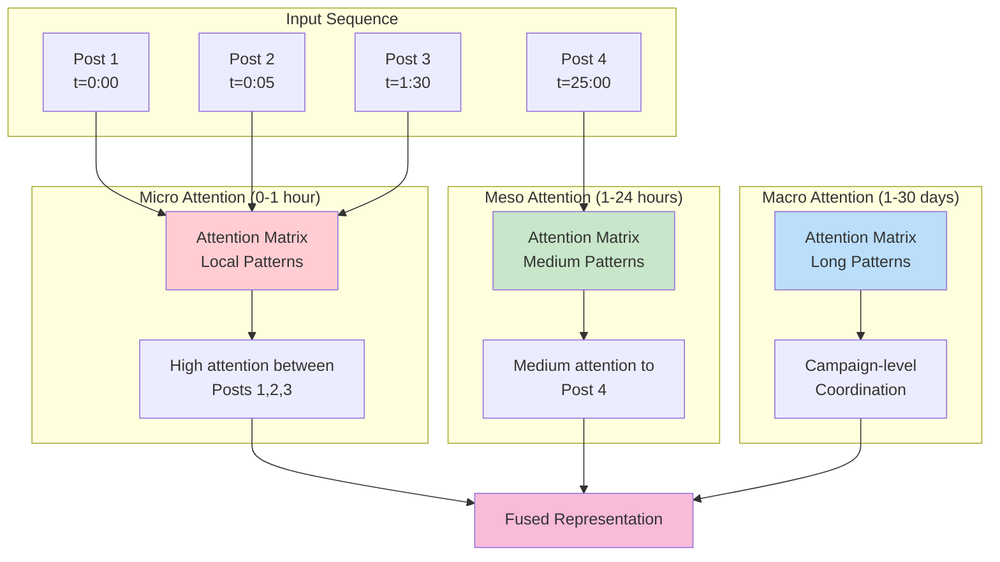
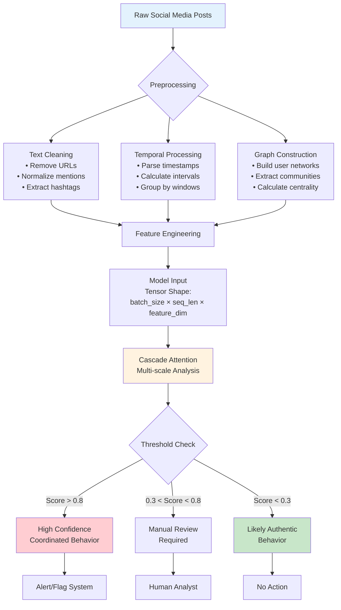
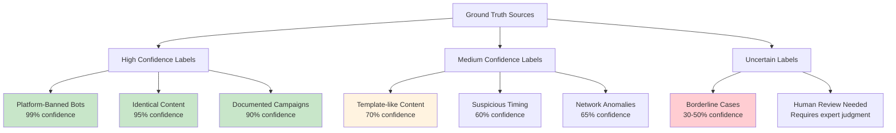
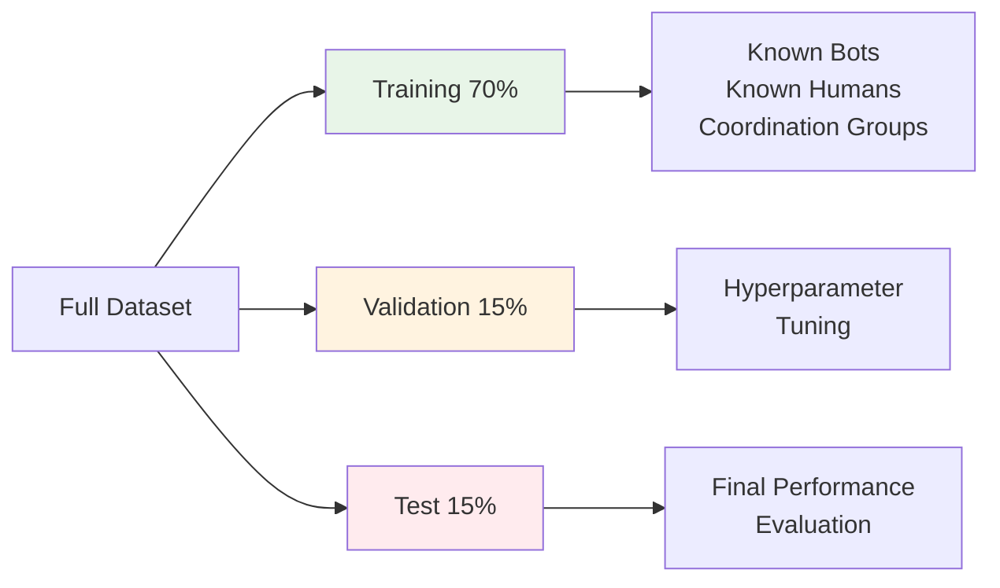

## Research Concept (9/2/25 Outside of Class 30mins):

### Neural Architecture for Detecting Coordinated Inauthentic Behavior in Digital Communications

Novelty: Fusion of temporal, textual, and network signals.

Goal: build a neural architecture trained on a labeled dataset from TwiBot-20 and Russian IRA on digital communications, that can discover inauthentic communications (bot networks/communications).

Publication Points:
polyci -> Combatting Fake News 
machine learning -> Novel Fusion Method
Dataset -> kaggle + seperate repository (master dataset compiled from both)

## Sweezy Notes + Model Architecture Notes (9/3/25):

Through WHS --> Access to Nature, JSTOR & other general research libraries.

Most insightful was access to Nature, which can be very useful for researching novel (and often ground-breaking) literature.
The rest was mostly repetitive, because I have become quite familiar with library resources over the years.

### Designed Overall Architecture Flow


Brushed up on NLP and Attention Mechanisms:

[Attention is All You Need](https://arxiv.org/abs/1706.03762)

[BERT: Pre-Training of Deep Bidirectional Transformers for Language Understanding](https://arxiv.org/abs/1810.04805)

## Researched Data Sources (9/4/25)

[TwiBot-22: Towards Graph-Based Twitter Bot Detection](https://arxiv.org/abs/2206.04564)

[Russian Troll Tweets](https://github.com/fivethirtyeight/russian-troll-tweets/)

Researched viable datasets and found TwiBot-22 (Investigated for dataset completion --> looked through dataset)

## Designed Data Pipelines (9/5/25)

### Data Flow Architecture



### Training Data Structure


## Designed Attention Mechanism and Scoped More General Pipeline (9/5/25 ~1.5 hours Outside of Class)

[Attention is All You Need](https://arxiv.org/abs/1706.03762)
### Cascade Attention Mechanism



### Detection Pipeline


## Mathematical Modeling (9/8/25 Outside of Class (2 hours)

### Mathematical Attention Visualization

#### Attention Weight Heatmap Example

```
Time →
Users ↓    0h    1h    6h   24h   48h
User A   [1.0] [0.9] [0.2] [0.1] [0.0]
User B   [0.9] [1.0] [0.2] [0.1] [0.0]  ← High coordination
User C   [0.9] [0.9] [1.0] [0.1] [0.0]  ← with Users A,B
User D   [0.1] [0.1] [0.2] [1.0] [0.8]  ← Different pattern
User E   [0.2] [0.3] [0.4] [0.5] [1.0]  ← Natural variation
```

### Coordination Score Formula
```
Coordination Score = Σ(temporal_sync × content_similarity × network_overlap)

Where:
• temporal_sync = exp(-(time_diff)²/σ²)
• content_similarity = cosine_similarity(text_embeddings)
• network_overlap = |common_connections| / |total_connections|
```

## Validation Methods + Success Metrics + Proposed Workflow(9/9/25)

### Training Data Sources and Labels

#### Ground Truth Hierarchy



#### Cross-Validation Strategy


### Model Performance Metrics

#### Evaluation Framework

| Metric | Target | Reasoning |
|--------|--------|-----------|
| **Precision** | >85% | Minimize false accusations |
| **Recall** | >75% | Catch most coordinated behavior |
| **F1-Score** | >80% | Balanced performance |
| **False Positive Rate** | <5% | Protect legitimate users |
| **Detection Speed** | <100ms | Real-time capability |

### Implementation Notes
**Workflow**:
1. **Download TwiBot-20** (largest, most comprehensive)
2. **Add Russian IRA data** (political coordination examples)
3. **Supplement with Reddit bot lists** (platform diversity)
4. **Train initial model** (you now have 250K+ labeled examples)
5. **Validate on recent events** (apply to unlabeled recent data)
