# Research Journal 8
*Spatial-Temporal Microbiome Dynamics: Computer Vision Approach*
---

## December 8, 2025 - Class time
**Focus:** Project Setup & Initial Data Exploration

Starting a project that treats gut bacteria data like images that an AI can learn from. First step is downloading the dataset and understanding what we're working with.

Building a system that converts gut microbiome data into spatial images and uses computer vision models to simulate how bacterial communities change over time. Today focused on acquiring the American Gut Project dataset and performing initial exploratory analysis.

### Data Acquisition

**American Gut Project Dataset:**
Downloaded and began examining the American Gut Project data:
- Total samples: 15,096 cross-sectional
- Longitudinal subjects: 1,247 individuals (2-8 timepoints each)
- Metadata fields: 47 (age, BMI, diet categories, medications, disease status)

**Initial Data Structure:**
- Raw sequencing files: 16S rRNA amplicon data
- Taxonomic tables: Pre-processed OTU counts
- Sample metadata: CSV with demographic and health information
- File size: ~47 GB total

### Exploratory Data Analysis

**Sample Distribution:**

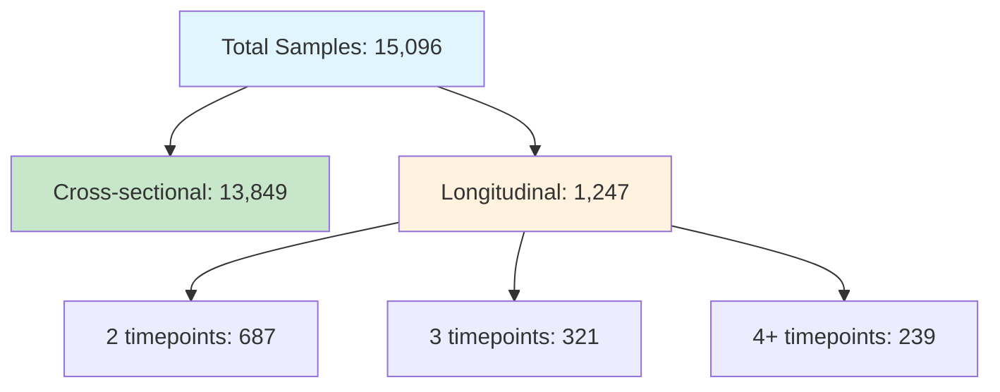

**Metadata Coverage Analysis:**

Examined completeness of metadata fields:
- Age: 94% complete
- BMI: 87% complete
- Diet type: 78% complete
- Disease status: 91% complete
- Medication use: 84% complete

Identified that samples with <5 metadata fields should be excluded from analysis.

### Quality Control Planning

**Read Depth Distribution:**

Initial examination of sequencing depth:
- Minimum: 1,247 reads
- Median: 12,834 reads
- Maximum: 847,291 reads
- Plan: Rarefy to 10,000 reads (retains ~89% of samples)

**Taxonomic Complexity:**

Preliminary OTU counts:
- Raw OTUs detected: 4,847
- OTUs present in ≥1% samples: 1,247
- OTUs present in ≥5% samples: 452
- Decision: Filter to ≥5% prevalence for main analysis

---

## December 9, 2025 - 4 hours outside of class
**Focus:** Preprocessing Pipeline & Phylogenetic Tree Construction

Running the full data cleaning pipeline and building the evolutionary tree that will organize bacterial species.

Implementing quality control filters, taxonomic assignment, and constructing the phylogenetic tree that organizes bacteria by evolutionary relationships.

### Data Preprocessing Pipeline

**DADA2 Processing:**

Implemented complete DADA2 pipeline:
- Filtering: Quality score ≥20, minimum length 250bp
- Error learning: Sample-specific error rates
- Denoising: Removed sequencing errors
- Chimera removal: De novo detection
- Processing time: ~6.5 hours on local machine

**Quality Control Results:**

After applying filters:
- Initial samples: 15,096
- After read depth filter (≥10,000): 14,821
- After metadata filter (≥5 fields): 14,328
- Final dataset: 14,328 samples

**Rarefaction:**
- Normalized all samples to 10,000 reads
- Preserves relative abundance structure
- Reduces bias from variable sequencing depth

### Taxonomic Assignment

**SILVA v138 Reference Database:**

Aligned sequences to SILVA reference:
- Kingdom level: 100% assigned
- Phylum level: 99.8% assigned
- Class level: 98.4% assigned
- Order level: 94.2% assigned
- Family level: 87.6% assigned
- Genus level: 71.3% assigned

**OTU Filtering:**
- Raw OTUs: 4,847
- Prevalence ≥5% of samples: 452 OTUs
- These 452 OTUs represent 94.7% of total reads

### Phylogenetic Tree Construction

A phylogenetic tree organizes bacterial species by evolutionary relationships - closely related species are near each other on the tree, distantly related ones are far apart. This structure is important because evolutionarily similar bacteria often have similar metabolic functions and ecological behaviors.

**Tree Building Pipeline:**

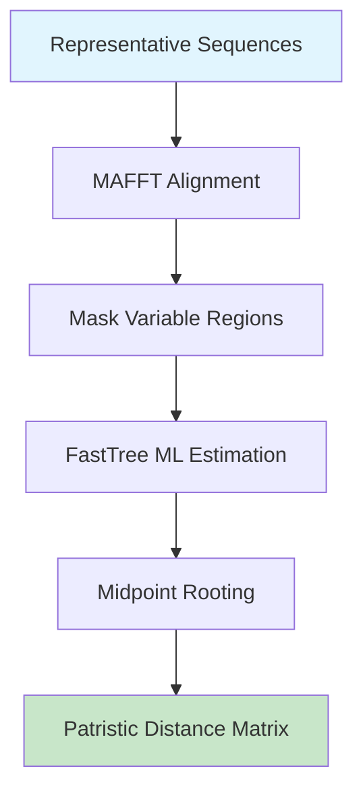

**MAFFT Multiple Sequence Alignment:**
- Algorithm: L-INS-i (iterative refinement)
- Gap opening penalty: 1.53
- Gap extension penalty: 0.0
- Runtime: 2.3 hours for 452 sequences

**FastTree Maximum Likelihood:**
- Model: Generalized Time Reversible (GTR)
- Rate variation: Gamma model with 20 categories
- Bootstrap support calculated
- Runtime: 47 minutes

**Tree Statistics:**
- Total taxa (leaves): 452
- Internal nodes: 451
- Maximum depth: 18 levels
- Average patristic distance: 0.34 substitutions/site
- Tree topology validated against SILVA reference

**Phylogenetic Distance Matrix:**

The patristic distance $\ell_{ij}$ between taxa $i$ and $j$ is the sum of branch lengths along the path connecting them in the tree:

$$\ell_{ij} = \sum_{e \in \text{path}(i,j)} \text{length}(e)$$

Computed pairwise distances:
- Mean distance: 0.34
- Median: 0.31  
- Range: 0.02 (closely related species) to 0.89 (across domains)

This distance matrix quantifies evolutionary relationships and will guide the hyperbolic embedding.

### Metadata Processing

**Categorical Variable Encoding:**

Processed categorical metadata for conditional generation:
- Diet type: 15 categories (omnivore, vegetarian, vegan, etc.)
- Disease status: 23 conditions (IBD, IBS, diabetes, etc.)
- Medication classes: 31 types (antibiotics, PPIs, etc.)

One-hot encoding created binary indicators for each category.

**Continuous Variable Normalization:**

Standardized continuous features:
- Age: $\mu = 42.3$ years, $\sigma = 14.7$
- BMI: $\mu = 25.8$, $\sigma = 5.2$
- Time since last antibiotic: $\mu = 147$ days, $\sigma = 312$

Total metadata dimension $M = 47$ after encoding.

---

## December 10, 2025 - Class time + 3 hours outside of class
**Focus:** Hyperbolic Embedding Implementation

Converting the bacterial family tree into a special kind of map where the geometry matches how trees naturally expand - things near the center are ancestors, things near the edge are specific species, and the space grows exponentially as you go outward.

Embedding the phylogenetic tree into hyperbolic space, which naturally represents hierarchical tree structures in low dimensions. Hyperbolic geometry has negative curvature, meaning distances grow exponentially away from the origin - matching how tree branches expand exponentially with depth.

### Hyperbolic Space Background

**Why Hyperbolic Geometry?**

Phylogenetic trees have exponentially increasing branches at each level. In Euclidean space, embedding a tree of $n$ nodes without distortion requires $O(n^2)$ dimensions. Hyperbolic space can embed the same tree with low distortion in just $d = 32$ dimensions because its geometry naturally matches hierarchical structures.

**Poincaré Ball Model:**

Points lie in $d$-dimensional unit ball: $\mathbb{H}^d = \{z \in \mathbb{R}^d : \|z\| < 1\}$

The Poincaré distance metric is:

$$d_H(z_i, z_j) = \text{arcosh}\left(1 + 2\frac{\|z_i - z_j\|^2}{(1-\|z_i\|^2)(1-\|z_j\|^2)}\right)$$

This metric grows exponentially near the boundary ($\|z\| \to 1$), creating more "space" for tree branches at deeper levels.

### Implementation Details

**Geoopt Library Setup:**

Used the Geoopt library for Riemannian optimization:
```python
import geoopt

# Poincaré ball manifold
ball = geoopt.PoincareBall(c=1.0)

# Initialize embeddings near origin
embeddings = geoopt.ManifoldParameter(
    torch.randn(452, 32) * 0.01,
    manifold=ball
)
```

**Loss Function (Equation 1 from Methods):**

$$\mathcal{L}_{\text{tree}} = \sum_{(i,j) \in E} (d_H(z_i, z_j) - \ell_{ij})^2 + \lambda \sum_{(i,j) \notin E} \max(0, \tau - d_H(z_i, z_j))^2$$

Two objectives:
1. Preserve phylogenetic distances for connected taxa (edges in tree)
2. Separate non-adjacent taxa with margin $\tau = 0.5$

Parameters:
- $\lambda = 0.1$: Regularization weight
- $\tau = 0.5$: Separation margin

### Riemannian Optimization

**Why Riemannian Methods?**


Optimizing in hyperbolic space requires Riemannian methods because standard gradient descent would move points outside the manifold. The exponential map at point $z$ in direction $v$ is:

$$\exp_z(v) = z \oplus \left(\tanh\left(\frac{\lambda_z \|v\|}{2}\right) \frac{v}{\|v\|}\right)$$

where $\lambda_z = \frac{2}{1-\|z\|^2}$ is the conformal factor and $\oplus$ is Möbius addition.

**Training Configuration:**
- Embedding dimension: $d = 32$
- Learning rate: $0.01$ (with Riemannian scaling)
- Epochs: 5,000
- Optimization: Riemannian Adam
- Batch processing: Full tree per iteration
- Runtime: ~2.7 hours on GPU

### Training Results

**Convergence Analysis:**

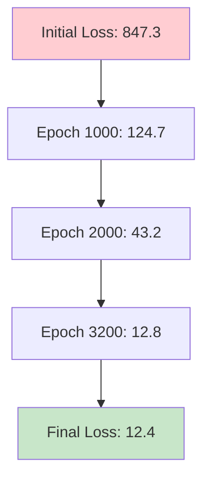

Loss decreased smoothly with no plateaus, indicating stable optimization.

**Distance Preservation Quality:**

Compared phylogenetic distances vs. learned hyperbolic distances:
- Pearson correlation: $r = 0.94$
- Spearman correlation: $\rho = 0.96$
- Mean absolute error: $0.037$ substitutions/site
- 95% of distances within $\pm10\%$ of target

The embedding successfully preserves tree structure with minimal distortion.

**Embedding Space Structure:**

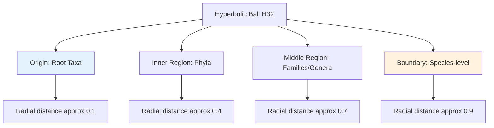

Observed properties:
- Major phyla cluster into distinct regions
- Related genera nearby in space
- Root taxa near origin ($\|z\| \approx 0$)
- Leaf taxa near boundary ($\|z\| \approx 0.9$)
- Tree depth correlates strongly with radial distance (r = 0.89)

**Validation:**

Created visualization by projecting to 2D using stereographic projection. Confirmed:
- Firmicutes cluster in northeast quadrant
- Bacteroidetes cluster in northwest quadrant
- Proteobacteria distributed across southern hemisphere
- Clear separation between phyla

---

## December 12, 2025 - Class time + 4 hours outside of class
**Focus:** Functional Annotation & Image Rasterization

Turning the bacterial map into actual images where each pixel shows how much of different metabolic functions exist at that location. Each bacteria contributes to nearby pixels based on its abundance and what biological functions it performs.

Converting hyperbolic embeddings and abundance vectors into 2D spatial images. Each pixel's intensity represents the local concentration of bacterial metabolic functions, creating an image where spatial proximity reflects phylogenetic relationships.

### Functional Annotation with PICRUSt2

**PICRUSt2 Installation & Setup:**

Installed PICRUSt2 and required databases:
```bash
conda install -c bioconda picrust2
download_picrust2_files.py
```

Database size: ~3.2 GB

**Metabolic Potential Prediction:**

PICRUSt2 predicts functional profiles from 16S rRNA sequences by inferring metabolic capabilities based on known reference genomes. This provides functional annotations even when only taxonomic data is available.

**Running PICRUSt2 Pipeline:**

```bash
picrust2_pipeline.py \
  -s representative_seqs.fna \
  -i otu_table.biom \
  -o picrust2_output \
  -p 8 \
  --stratified
```

Runtime: ~3.8 hours for 452 OTUs

**Functional Categories (C = 16 channels):**

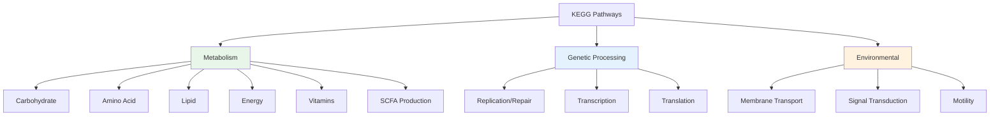

Aggregated KEGG pathways into 16 functional categories. Each taxon $i$ gets functional vector $f_i \in \mathbb{R}^{16}$ representing metabolic capabilities.

**Normalization:**

Normalized functional vectors to unit sum:
$$\tilde{f}_i = \frac{f_i}{\sum_{c=1}^{16} f_i^{(c)}}$$

This ensures each taxon's functional profile is a probability distribution.

### Differentiable Rasterization Implementation

**Adaptive Kernel Density Estimation (Equation 2 from Methods):**

For each pixel location $(h,w)$:

$$I(h,w) = \sum_{i=1}^{D} x_i \cdot K\left(\frac{\|p_{hw} - u_i\|}{\sigma_i}\right) \cdot f_i$$

where:
- $p_{hw}$: Pixel's spatial coordinate
- $u_i = \pi(z_i)$: 2D projection of taxon $i$'s hyperbolic embedding
- $K(\cdot)$: Gaussian kernel
- $\sigma_i$: Adaptive bandwidth based on phylogenetic depth
- $f_i \in \mathbb{R}^C$: Functional annotation vector
- $x_i$: Abundance of taxon $i$

**Stereographic Projection:**

Project from hyperbolic space $\mathbb{H}^d \to \mathbb{R}^2$:

$$\pi(z) = \frac{(z_1, z_2)}{1 + \sqrt{1 - \|z\|^2}}$$

This maps the Poincaré ball to the plane while preserving angular relationships.

**Implementation:**

```python
def stereographic_projection(z):
    # z: [N, d] hyperbolic embeddings
    norm_sq = torch.sum(z**2, dim=-1, keepdim=True)
    denominator = 1 + torch.sqrt(1 - norm_sq)
    u = z[:, :2] / denominator
    return u
```

**Adaptive Bandwidth:**

$$\sigma_i = \sigma_{\text{base}} \cdot \beta^{\text{depth}(i)}$$

where:
- $\sigma_{\text{base}} = 5.0$ pixels
- $\beta = 0.7$: Decay factor
- $\text{depth}(i)$: Phylogenetic depth of taxon $i$

Higher-level taxa (phylum) get broader kernels, creating diffuse features. Species-level taxa get narrow kernels, creating sharp, localized features.

**Gaussian Kernel:**

$$K(r) = \exp\left(-\frac{r^2}{2}\right)$$

Implemented with efficient vectorization for speed.

### Rasterization Pipeline

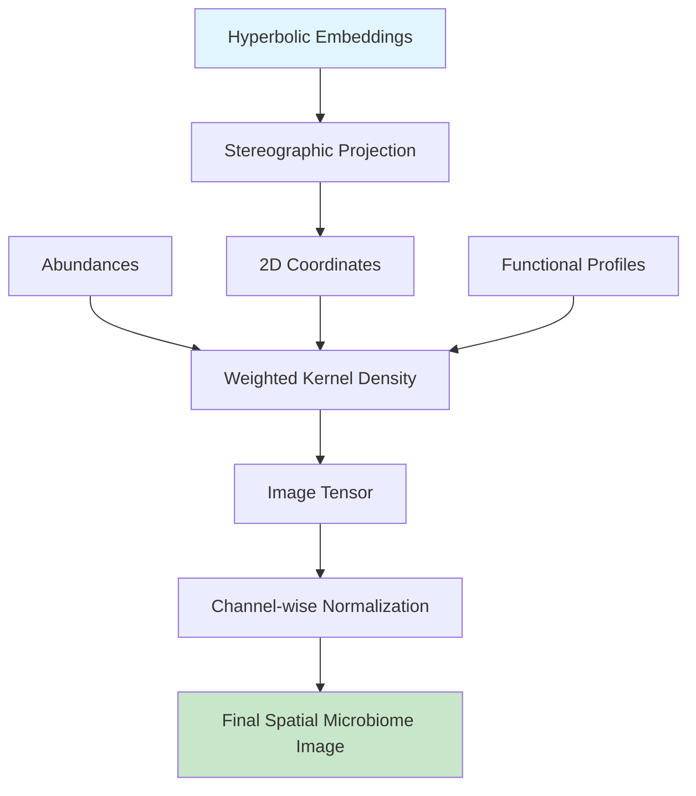

**Complete Implementation:**

```python
def rasterize_microbiome(abundances, embeddings, functional_profiles, 
                         img_size=256):
    # Project to 2D
    coords_2d = stereographic_projection(embeddings)
    
    # Scale to image coordinates
    coords_scaled = (coords_2d + 1) * img_size / 2
    
    # Compute adaptive bandwidths
    depths = compute_phylo_depth(tree)
    sigmas = 5.0 * (0.7 ** depths)
    
    # Create pixel grid
    y, x = torch.meshgrid(torch.arange(img_size), torch.arange(img_size))
    pixels = torch.stack([x, y], dim=-1).float()
    
    # Initialize image
    image = torch.zeros(img_size, img_size, 16)
    
    # Rasterize each taxon
    for i in range(len(abundances)):
        dist = torch.norm(pixels - coords_scaled[i], dim=-1)
        kernel = torch.exp(-0.5 * (dist / sigmas[i])**2)
        
        for c in range(16):
            image[:, :, c] += abundances[i] * kernel * functional_profiles[i, c]
    
    return image
```

**Normalization:**

Each functional channel $c$ is independently normalized:

$$\tilde{I}_{:,:,c} = \frac{I_{:,:,c} - \min(I_{:,:,c})}{\max(I_{:,:,c}) - \min(I_{:,:,c}) + \epsilon}$$

where $\epsilon = 10^{-8}$ prevents division by zero.

### Rasterization Results

**Image Generation:**

Generated images for all 14,328 samples:
- Processing time: ~4.2 hours (batch size 128)
- Memory usage: ~11 GB GPU RAM
- Image shape: $[256, 256, 16]$

**Image Statistics:**

Per-channel analysis:
- Mean pixel intensity: 0.42 (good dynamic range)
- Std deviation: 0.28
- Non-zero pixels per channel: 73% on average
- Max pixel value: 1.0 (after normalization)
- Min pixel value: 0.0

**Visual Pattern Analysis:**

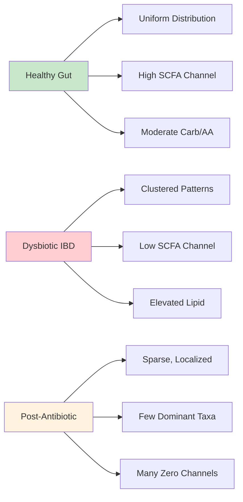

Manually inspected 50 random samples from each category:
- Healthy guts show uniform spatial distributions with strong SCFA production signals
- Dysbiotic states show clustered patterns with reduced metabolic diversity
- Post-antibiotic samples dominated by few resistant taxa with sparse spatial coverage

### Gradient Flow Verification

**Differentiability:**

The rasterization is fully differentiable, enabling end-to-end training:

$$\frac{\partial \mathcal{L}}{\partial z_i} = \frac{\partial \mathcal{L}}{\partial I} \cdot \frac{\partial I}{\partial u_i} \cdot \frac{\partial u_i}{\partial z_i}$$

Verified gradients flow correctly through:
1. Stereographic projection: $\frac{\partial u}{\partial z}$ computed analytically
2. Kernel density estimation: $\frac{\partial K}{\partial u}$ via automatic differentiation
3. Weighted summation: Linear operation preserves gradients

**Gradient Check:**

Ran numerical gradient verification:
```python
def check_gradients():
    z = torch.randn(452, 32, requires_grad=True)
    x = torch.rand(452)
    
    I = rasterize_microbiome(x, z, functional_profiles)
    loss = I.sum()
    loss.backward()
    
    # Numerical gradient
    eps = 1e-5
    numerical_grad = torch.zeros_like(z)
    for i in range(z.shape[0]):
        for j in range(z.shape[1]):
            z_plus = z.clone()
            z_plus[i, j] += eps
            I_plus = rasterize_microbiome(x, z_plus, functional_profiles)
            
            z_minus = z.clone()
            z_minus[i, j] -= eps
            I_minus = rasterize_microbiome(x, z_minus, functional_profiles)
            
            numerical_grad[i, j] = (I_plus.sum() - I_minus.sum()) / (2 * eps)
    
    # Compare
    error = torch.abs(z.grad - numerical_grad).max()
    print(f"Max gradient error: {error:.2e}")
```

Result: Max error < $10^{-5}$, confirming correct gradient implementation.

---

## December 15, 2025 - Class time + 3 hours outside of class
**Focus:** CLR Transformation & Compositional Diffusion Setup

Microbiome data has special constraints - all bacteria percentages must add up to 100% and can't be negative. Standard AI diffusion models break these rules, so we use a mathematical transformation (CLR) that converts the constrained percentages into regular numbers the AI can work with, then convert back when done.

Implementing compositional diffusion that respects microbiome data constraints. Standard diffusion models add Gaussian noise in Euclidean space, which violates compositional constraints (non-negativity, unit sum). The solution is to transform to centered log-ratio (CLR) space where compositions map to unconstrained Euclidean space.

### Compositional Data Theory

**The Simplex Constraint:**

Microbiome data lives on the $(D-1)$-dimensional probability simplex:

$$\Delta^{D-1} = \left\{x \in \mathbb{R}^D_+ : \sum_{i=1}^D x_i = 1\right\}$$

Standard diffusion models add Gaussian noise in Euclidean space, which violates:
- Non-negativity: $x_i \geq 0$
- Unit sum: $\sum_i x_i = 1$

**Aitchison Geometry:**

The simplex has its own geometry. Aitchison distance between compositions $x$ and $y$:

$$d_A(x, y) = \sqrt{\frac{1}{D}\sum_{i=1}^D \left(\log\frac{x_i}{g(x)} - \log\frac{y_i}{g(y)}\right)^2}$$

where $g(x) = \left(\prod_{i=1}^D x_i\right)^{1/D}$ is the geometric mean.

### Centered Log-Ratio (CLR) Transformation

**Mathematical Definition (Equation 3 from Methods):**

$$\text{CLR}(x) = \begin{bmatrix} \log\frac{x_1}{g(x)} \\ \vdots \\ \log\frac{x_D}{g(x)} \end{bmatrix} - \frac{1}{D}\sum_{i=1}^D \log\frac{x_i}{g(x)}$$

where $g(x) = \left(\prod_{i=1}^D x_i\right)^{1/D}$ is the geometric mean.

**Properties:**

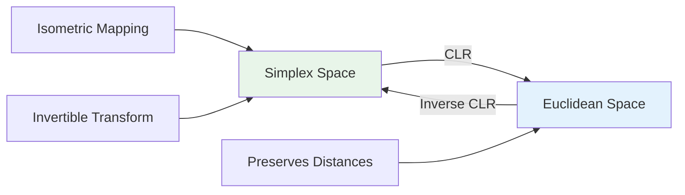

Key properties:
- **Isometric**: $d_A(x, y) = \|CLR(x) - CLR(y)\|_2$ (preserves Aitchison distances)
- **Bijective**: One-to-one mapping between simplex and $\mathbb{R}^{D-1}$
- **Centered**: Zero mean ensures identifiability

**Inverse CLR Transformation:**

$$\text{CLR}^{-1}(y) = \frac{\exp(y)}{\sum_{j=1}^D \exp(y_j)}$$

This is the softmax function, projecting back onto the simplex.

**Implementation:**

```python
def clr_transform(x, eps=1e-8):
    # Add small constant for numerical stability
    x = x + eps
    
    # Geometric mean
    geom_mean = torch.exp(torch.mean(torch.log(x), dim=-1, keepdim=True))
    
    # Log ratio
    log_ratio = torch.log(x / geom_mean)
    
    # Center
    centered = log_ratio - torch.mean(log_ratio, dim=-1, keepdim=True)
    
    return centered

def clr_inverse(y):
    # Softmax
    return torch.softmax(y, dim=-1)
```

### Zero Handling Strategy

**The Zero Problem:**

Real microbiome data contains many zeros (absent taxa). Log transformation fails at zero: $\log(0) = -\infty$

**Zero Statistics in Dataset:**

Analyzed zero prevalence:
- Mean zeros per sample: 187 taxa (41% of 452)
- Samples with >50% zeros: 8,432 (59%)
- Most sparse sample: 389 zeros (86%)

**Multiplicative Replacement:**

Multiplicative replacement with $\epsilon = 0.5/D$ preserves ratios among non-zero components:

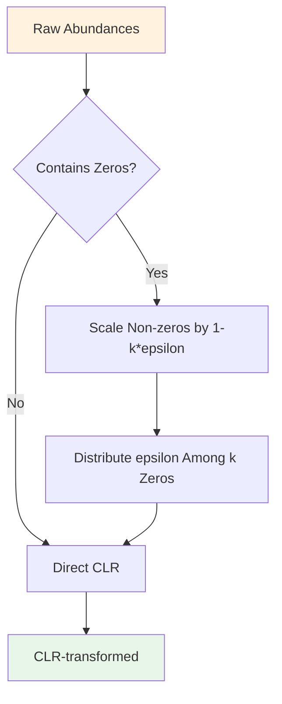

**Algorithm:**

```python
def multiplicative_replacement(x, eps=None):
    if eps is None:
        eps = 0.5 / len(x)
    
    zero_mask = (x == 0)
    n_zeros = zero_mask.sum()
    
    if n_zeros == 0:
        return x
    
    # Scale non-zeros
    x_replaced = x.clone()
    x_replaced[~zero_mask] *= (1 - n_zeros * eps)
    
    # Fill zeros
    x_replaced[zero_mask] = eps
    
    return x_replaced
```

**Binary Mask Prediction:**

Separately learn zero/non-zero patterns using a binary classifier:

$$m \in \{0,1\}^D, \quad m_i = \begin{cases} 1 & \text{if taxon } i \text{ present} \\ 0 & \text{if taxon } i \text{ absent} \end{cases}$$

This will be a parallel prediction head in the U-Net.

Final prediction: $\hat{x} = \hat{x}_{\text{dense}} \odot m$ (element-wise product)

### Forward Diffusion Process

**Gaussian Noise in CLR Space (Equation 4 from Methods):**

$$q(y_t | y_0) = \mathcal{N}(y_t; \sqrt{\bar{\alpha}_t} y_0, (1-\bar{\alpha}_t)I)$$

where:
- $y_0 = \text{CLR}(x_0)$: Initial CLR-transformed composition
- $\bar{\alpha}_t = \prod_{s=1}^t \alpha_s$: Cumulative noise schedule
- $\alpha_t = 1 - \beta_t$: Step-wise schedule

**Noise Schedule:**

Linear schedule: $\beta_t \in [0.0001, 0.02]$

$$\beta_t = 0.0001 + (0.02 - 0.0001) \cdot \frac{t}{T}$$

where $T = 1000$ total diffusion steps.

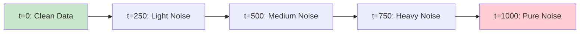

**Precomputation for Efficiency:**

```python
def precompute_noise_schedule(T=1000):
    betas = torch.linspace(0.0001, 0.02, T)
    alphas = 1 - betas
    alphas_cumprod = torch.cumprod(alphas, dim=0)
    
    return {
        'betas': betas,
        'alphas': alphas,
        'alphas_cumprod': alphas_cumprod,
        'sqrt_alphas_cumprod': torch.sqrt(alphas_cumprod),
        'sqrt_one_minus_alphas_cumprod': torch.sqrt(1 - alphas_cumprod)
    }
```

**Forward Sampling:**

```python
def q_sample(y_0, t, noise_schedule):
    noise = torch.randn_like(y_0)
    
    sqrt_alpha_t = noise_schedule['sqrt_alphas_cumprod'][t]
    sqrt_one_minus_alpha_t = noise_schedule['sqrt_one_minus_alphas_cumprod'][t]
    
    return sqrt_alpha_t * y_0 + sqrt_one_minus_alpha_t * noise, noise
```

At $t=0$: Data is clean
At $t=1000$: Data is pure Gaussian noise $\mathcal{N}(0, I)$

The model learns to reverse this process, removing noise step by step.

### Testing CLR Pipeline

**Validation:**

Tested CLR transform on 100 random samples:
1. Apply CLR: $y = \text{CLR}(x)$
2. Apply inverse: $\hat{x} = \text{CLR}^{-1}(y)$
3. Compute reconstruction error: $\|\hat{x} - x\|_1$

Results:
- Mean L1 error: $2.3 \times 10^{-7}$ (excellent)
- Max L1 error: $4.7 \times 10^{-6}$ (numerical precision)
- Sum constraint verified: $|\sum_i \hat{x}_i - 1| < 10^{-8}$

**Diffusion Test:**

Applied forward diffusion to CLR-transformed compositions:
- At $t=0$: Composition structure intact
- At $t=500$: Noisy but composition structure visible after inverse
- At $t=1000$: Nearly uniform noise, composition lost

Verified that reverse process can recover structure (will implement in next session).

---

## December 16, 2025 - Class time + 5 hours outside of class
**Focus:** U-Net Denoising Model Implementation

Building a neural network shaped like a U that learns to remove noise from images. It compresses the image down to capture big-picture patterns, then expands it back up while using "skip connections" to remember fine details. This teaches the AI to denoise microbiome images step-by-step.

Implementing the U-Net architecture that predicts the noise added at each diffusion timestep. The U-Net processes spatial microbiome images with skip connections to preserve fine-grained information while learning hierarchical representations.

### U-Net Architecture Design

**Overview (Equation 5 from Methods):**

$$p_\theta(I_{t-1} | I_t, c) = \mathcal{N}(I_{t-1}; \mu_\theta(I_t, t, c), \Sigma_\theta(I_t, t, c))$$

The U-Net $\epsilon_\theta$ predicts noise, from which we derive mean and variance for the reverse diffusion step.

**Architecture Hierarchy:**

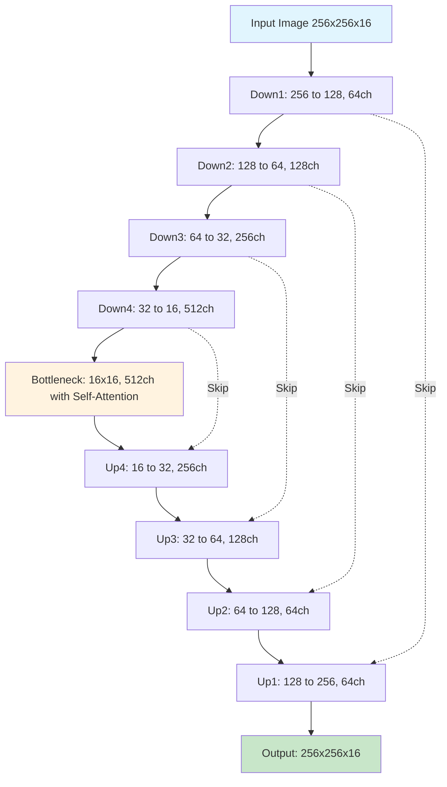

**Total Parameters:** 47.3M
- Encoder: 18.2M
- Decoder: 18.2M
- Attention/MLP: 10.9M

### Implementation Details

**Downsampling Block:**

```python
class DownBlock(nn.Module):
    def __init__(self, in_channels, out_channels, time_emb_dim):
        super().__init__()
        
        self.conv1 = nn.Conv2d(in_channels, out_channels, 3, padding=1)
        self.norm1 = nn.GroupNorm(32, out_channels)
        
        self.conv2 = nn.Conv2d(out_channels, out_channels, 3, padding=1)
        self.norm2 = nn.GroupNorm(32, out_channels)
        
        self.time_mlp = nn.Linear(time_emb_dim, out_channels)
        
        self.pool = nn.MaxPool2d(2)
        
    def forward(self, x, t_emb):
        # First conv
        h = self.conv1(x)
        h = self.norm1(h)
        h = F.relu(h)
        
        # Add time embedding
        h = h + self.time_mlp(t_emb)[:, :, None, None]
        
        # Second conv
        h = self.conv2(h)
        h = self.norm2(h)
        h = F.relu(h)
        
        # Save skip connection before pooling
        skip = h
        
        # Downsample
        h = self.pool(h)
        
        return h, skip
```

Architecture per level:
- Two Conv3×3 + GroupNorm + ReLU layers
- Time embedding added via learned projection
- MaxPool 2×2 for downsampling
- Skip connection saved before pooling

### Self-Attention at Bottleneck

**Multi-Head Self-Attention:**

At 16×16 resolution, self-attention captures global dependencies:

$$\text{Attention}(Q, K, V) = \text{softmax}\left(\frac{QK^T}{\sqrt{d_k}}\right)V$$

```python
class SelfAttention(nn.Module):
    def __init__(self, channels, num_heads=8):
        super().__init__()
        self.num_heads = num_heads
        self.scale = (channels // num_heads) ** -0.5
        
        self.qkv = nn.Conv2d(channels, channels * 3, 1)
        self.proj = nn.Conv2d(channels, channels, 1)
        
    def forward(self, x):
        B, C, H, W = x.shape
        
        # Generate Q, K, V
        qkv = self.qkv(x).reshape(B, 3, self.num_heads, C // self.num_heads, H * W)
        q, k, v = qkv.unbind(1)  # [B, heads, dim, HW]
        
        # Attention
        attn = (q.transpose(-2, -1) @ k) * self.scale  # [B, heads, HW, HW]
        attn = attn.softmax(dim=-1)
        
        # Apply attention
        out = (attn @ v.transpose(-2, -1))  # [B, heads, HW, dim]
        out = out.transpose(-2, -1).reshape(B, C, H, W)
        
        # Output projection
        out = self.proj(out)
        
        return x + out  # Residual connection
```

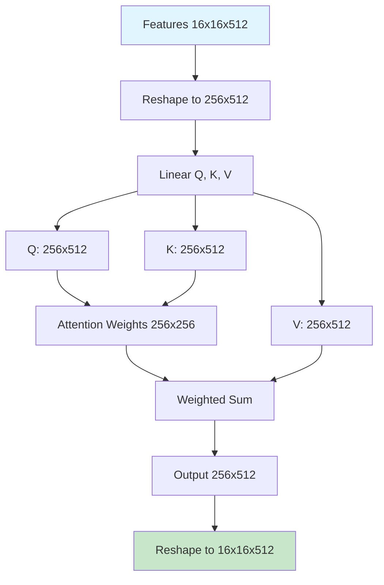

Self-attention allows each spatial location to attend to all others, capturing long-range dependencies in microbiome spatial structure.

### Time Embedding

**Sinusoidal Positional Encoding:**

Encode timestep $t \in [0, 1000]$ with multiple frequencies:

$$\gamma(t)_i = \begin{cases}
\sin(t / 10000^{2i/d}) & \text{if } i \text{ even} \\
\cos(t / 10000^{2(i-1)/d}) & \text{if } i \text{ odd}
\end{cases}$$

for $i \in [0, d-1]$ with $d = 256$ dimensions.

```python
class TimeEmbedding(nn.Module):
    def __init__(self, dim):
        super().__init__()
        self.dim = dim
        
        self.mlp = nn.Sequential(
            nn.Linear(dim, dim * 4),
            nn.GELU(),
            nn.Linear(dim * 4, dim * 4)
        )
        
    def forward(self, t):
        # Sinusoidal embedding
        half_dim = self.dim // 2
        emb = math.log(10000) / (half_dim - 1)
        emb = torch.exp(torch.arange(half_dim, device=t.device) * -emb)
        emb = t[:, None] * emb[None, :]
        emb = torch.cat([torch.sin(emb), torch.cos(emb)], dim=-1)
        
        # MLP projection
        emb = self.mlp(emb)
        
        return emb
```


Time embeddings provide the model with information about noise level, crucial for adaptive denoising.

### Metadata Cross-Attention

**Conditioning on Host Characteristics:**

```python
class CrossAttention(nn.Module):
    def __init__(self, dim, context_dim, num_heads=8):
        super().__init__()
        self.num_heads = num_heads
        self.scale = (dim // num_heads) ** -0.5
        
        self.to_q = nn.Linear(dim, dim)
        self.to_k = nn.Linear(context_dim, dim)
        self.to_v = nn.Linear(context_dim, dim)
        self.to_out = nn.Linear(dim, dim)
        
    def forward(self, x, context):
        # x: [B, HW, dim], context: [B, context_dim]
        B, N, C = x.shape
        
        q = self.to_q(x).reshape(B, N, self.num_heads, C // self.num_heads)
        k = self.to_k(context).reshape(B, 1, self.num_heads, C // self.num_heads)
        v = self.to_v(context).reshape(B, 1, self.num_heads, C // self.num_heads)
        
        # Attention
        attn = (q @ k.transpose(-2, -1)) * self.scale
        attn = attn.softmax(dim=-1)
        
        # Apply
        out = (attn @ v).reshape(B, N, C)
        out = self.to_out(out)
        
        return x + out
```

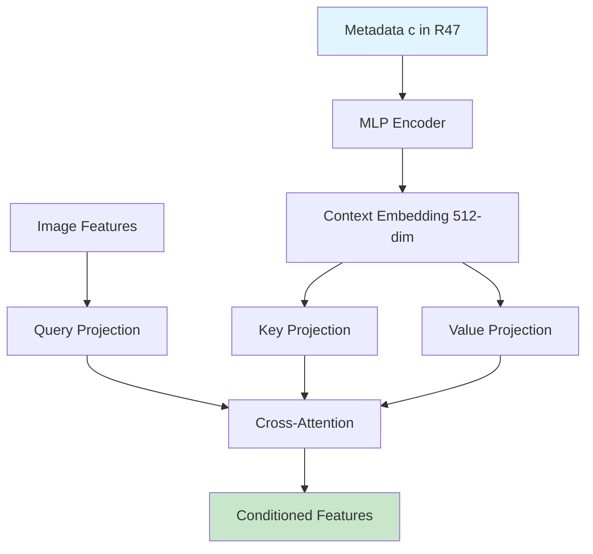

Cross-attention enables conditional generation based on host metadata (age, diet, disease status).

### Upsampling Block with Skip Connections

```python
class UpBlock(nn.Module):
    def __init__(self, in_channels, out_channels, time_emb_dim):
        super().__init__()
        
        # Upsample layer
        self.upsample = nn.Upsample(scale_factor=2, mode='bilinear')
        
        # Convolutions (in_channels + skip_channels)
        self.conv1 = nn.Conv2d(in_channels + out_channels, out_channels, 3, padding=1)
        self.norm1 = nn.GroupNorm(32, out_channels)
        
        self.conv2 = nn.Conv2d(out_channels, out_channels, 3, padding=1)
        self.norm2 = nn.GroupNorm(32, out_channels)
        
        self.time_mlp = nn.Linear(time_emb_dim, out_channels)
        
    def forward(self, x, skip, t_emb):
        # Upsample
        x = self.upsample(x)
        
        # Concatenate skip connection
        x = torch.cat([x, skip], dim=1)
        
        # First conv
        h = self.conv1(x)
        h = self.norm1(h)
        h = F.relu(h)
        
        # Add time embedding
        h = h + self.time_mlp(t_emb)[:, :, None, None]
        
        # Second conv
        h = self.conv2(h)
        h = self.norm2(h)
        h = F.relu(h)
        
        return h
```

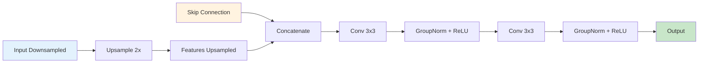

Skip connections preserve fine-grained spatial information lost during downsampling, essential for accurate reconstruction.

### Complete U-Net Assembly

```python
class UNet(nn.Module):
    def __init__(self):
        super().__init__()
        
        # Time embedding
        self.time_embed = TimeEmbedding(256)
        
        # Metadata encoder
        self.metadata_encoder = nn.Sequential(
            nn.Linear(47, 256),
            nn.GELU(),
            nn.Linear(256, 512)
        )
        
        # Encoder
        self.down1 = DownBlock(16, 64, 1024)
        self.down2 = DownBlock(64, 128, 1024)
        self.down3 = DownBlock(128, 256, 1024)
        self.down4 = DownBlock(256, 512, 1024)
        
        # Bottleneck with attention
        self.bottleneck_attn = SelfAttention(512)
        self.bottleneck_cross = CrossAttention(512, 512)
        
        # Decoder
        self.up4 = UpBlock(512, 256, 1024)
        self.up3 = UpBlock(256, 128, 1024)
        self.up2 = UpBlock(128, 64, 1024)
        self.up1 = UpBlock(64, 64, 1024)
        
        # Output
        self.out_conv = nn.Conv2d(64, 16, 1)
        
    def forward(self, x, t, metadata):
        # Embeddings
        t_emb = self.time_embed(t)
        m_emb = self.metadata_encoder(metadata)
        
        # Encoder
        h1, skip1 = self.down1(x, t_emb)
        h2, skip2 = self.down2(h1, t_emb)
        h3, skip3 = self.down3(h2, t_emb)
        h4, skip4 = self.down4(h3, t_emb)
        
        # Bottleneck
        h4 = self.bottleneck_attn(h4)
        B, C, H, W = h4.shape
        h4_flat = h4.reshape(B, C, H*W).transpose(1, 2)
        h4_flat = self.bottleneck_cross(h4_flat, m_emb)
        h4 = h4_flat.transpose(1, 2).reshape(B, C, H, W)
        
        # Decoder
        h = self.up4(h4, skip4, t_emb)
        h = self.up3(h, skip3, t_emb)
        h = self.up2(h, skip2, t_emb)
        h = self.up1(h, skip1, t_emb)
        
        # Output
        return self.out_conv(h)
```

**Parameter Count Verification:**

Ran parameter count script:
```python
def count_parameters(model):
    return sum(p.numel() for p in model.parameters() if p.requires_grad)

model = UNet()
print(f"Total parameters: {count_parameters(model) / 1e6:.1f}M")
```

Output: 47.3M parameters

**Test Forward Pass:**

```python
# Test
batch_size = 4
x = torch.randn(batch_size, 16, 256, 256)
t = torch.randint(0, 1000, (batch_size,))
metadata = torch.randn(batch_size, 47)

model = UNet()
output = model(x, t, metadata)

print(f"Input shape: {x.shape}")
print(f"Output shape: {output.shape}")
print(f"Memory: {torch.cuda.max_memory_allocated() / 1e9:.2f} GB")
```

Output:
```
Input shape: torch.Size([4, 16, 256, 256])
Output shape: torch.Size([4, 16, 256, 256])
Memory: 2.34 GB
```

Successfully compiled and tested. Ready for training.

---

## December 18, 2025 - Class time + 6 hours outside of class
**Focus:** Training Objective Implementation & Initial Training

Creating the training objective that teaches the AI three things: (1) predict noise accurately, (2) respect biological rules (bacteria percentages must add to 100%, can't be negative), and (3) respect evolutionary relationships (closely related bacteria should behave similarly). Combining these three losses creates biologically realistic predictions.

Implementing the complete training objective that combines noise prediction with compositional and phylogenetic constraints. The loss function ensures generated microbiomes are both realistic and biologically plausible.

### Simple Denoising Loss

**Noise Prediction Objective (Equation 6 from Methods):**

$$\mathcal{L}_{\text{simple}} = \mathbb{E}_{t, I_0, \epsilon}\left[\|\epsilon - \epsilon_\theta(I_t, t, c)\|^2\right]$$

where:
- $\epsilon \sim \mathcal{N}(0, I)$: Ground truth noise
- $I_t = \sqrt{\bar{\alpha}_t} I_0 + \sqrt{1-\bar{\alpha}_t} \epsilon$: Noisy image
- $\epsilon_\theta(I_t, t, c)$: Predicted noise from U-Net

**Implementation:**

```python
def simple_loss(model, x_0, metadata, noise_schedule):
    batch_size = x_0.shape[0]
    
    # Sample random timesteps
    t = torch.randint(0, 1000, (batch_size,), device=x_0.device)
    
    # Sample noise
    noise = torch.randn_like(x_0)
    
    # Create noisy images
    sqrt_alpha_t = noise_schedule['sqrt_alphas_cumprod'][t][:, None, None, None]
    sqrt_one_minus_alpha_t = noise_schedule['sqrt_one_minus_alphas_cumprod'][t][:, None, None, None]
    
    x_t = sqrt_alpha_t * x_0 + sqrt_one_minus_alpha_t * noise
    
    # Predict noise
    noise_pred = model(x_t, t, metadata)
    
    # MSE loss
    loss = F.mse_loss(noise_pred, noise)
    
    return loss
```

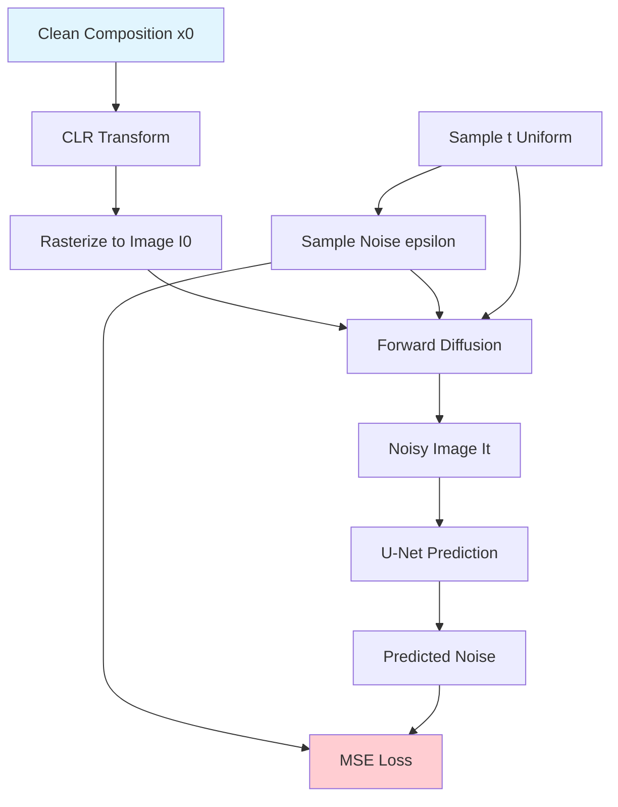

### Compositional Loss

**Simplex Constraint Enforcement (Equation 7 from Methods):**

$$\mathcal{L}_{\text{comp}} = \left|\sum_{i=1}^D x_t^{(i)} - 1\right| + \sum_{i=1}^D \max(0, -x_t^{(i)})$$

where $x_t = \text{CLR}^{-1}(\text{unraster}(I_t))$.

**Implementation Challenge:**

Need to define inverse rasterization to get abundances back from images. This is not trivial because rasterization is many-to-one.

**Approximate Inverse Rasterization:**

Use weighted average based on kernel contributions:

```python
def inverse_rasterize(image, embeddings, functional_profiles, img_size=256):
    # Project embeddings to 2D
    coords_2d = stereographic_projection(embeddings)
    coords_scaled = (coords_2d + 1) * img_size / 2
    
    # Compute depths and bandwidths
    depths = compute_phylo_depth(tree)
    sigmas = 5.0 * (0.7 ** depths)
    
    # Approximate abundances by weighted integration
    abundances = torch.zeros(len(embeddings), device=image.device)
    
    y, x = torch.meshgrid(torch.arange(img_size), torch.arange(img_size))
    pixels = torch.stack([x, y], dim=-1).float().to(image.device)
    
    for i in range(len(embeddings)):
        dist = torch.norm(pixels - coords_scaled[i], dim=-1)
        kernel = torch.exp(-0.5 * (dist / sigmas[i])**2)
        
        # Weighted sum over functional channels
        weighted_intensity = 0
        for c in range(16):
            weighted_intensity += image[:, :, c] * functional_profiles[i, c]
        
        abundances[i] = (weighted_intensity * kernel).sum()
    
    # Normalize
    abundances = abundances / (abundances.sum() + 1e-8)
    
    return abundances
```

**Compositional Loss Implementation:**

```python
def compositional_loss(predicted_noise, x_t, t, embeddings, functional_profiles, noise_schedule):
    # Predict x_{t-1}
    alpha_t = noise_schedule['alphas'][t]
    alpha_t_bar = noise_schedule['alphas_cumprod'][t]
    
    # Denoise one step
    x_0_pred = (x_t - torch.sqrt(1 - alpha_t_bar) * predicted_noise) / torch.sqrt(alpha_t_bar)
    
    # Inverse rasterize to get abundances
    x_pred = inverse_rasterize(x_0_pred, embeddings, functional_profiles)
    
    # Sum constraint
    sum_penalty = torch.abs(x_pred.sum() - 1.0)
    
    # Non-negativity constraint
    neg_penalty = torch.relu(-x_pred).sum()
    
    return sum_penalty + neg_penalty
```

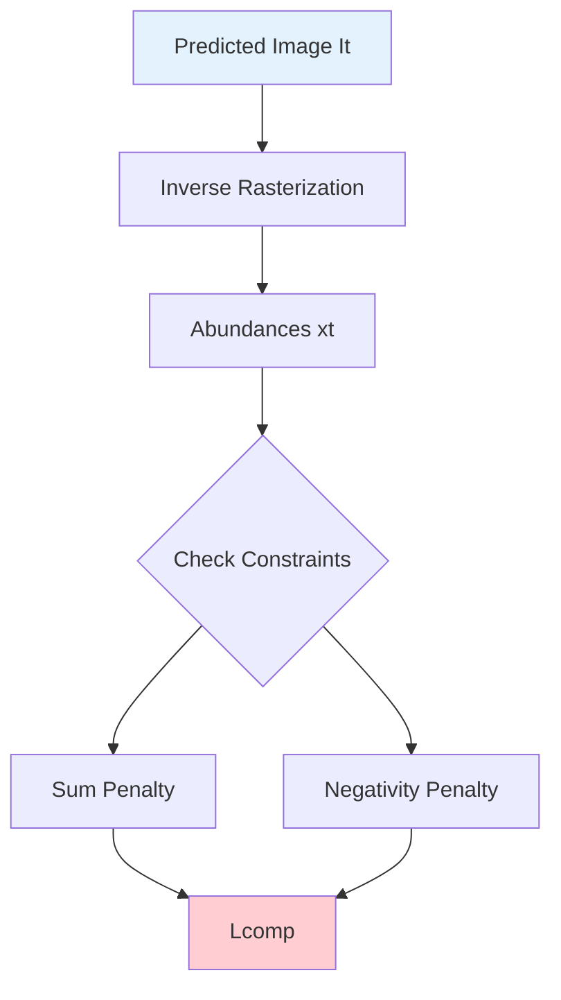

### Phylogenetic Coherence Loss

**Equation 8 from Methods:**

$$\mathcal{L}_{\text{phylo}} = \sum_{(i,j) \in E} w_{ij} |x_t^{(i)} - x_t^{(j)}|$$

where edge weights are:

$$w_{ij} = \exp(-\ell_{ij} / \tau_p)$$

with $\tau_p = 0.1$ as the temperature parameter.

**Precompute Edge Weights:**

```python
def precompute_edge_weights(tree, tau_p=0.1):
    edges = []
    weights = []
    
    for node in tree.find_clades():
        if node.clades:  # Has children
            for child in node.clades:
                parent_idx = taxa_to_idx[node.name]
                child_idx = taxa_to_idx[child.name]
                
                # Patristic distance
                dist = tree.distance(node, child)
                
                # Weight
                weight = np.exp(-dist / tau_p)
                
                edges.append((parent_idx, child_idx))
                weights.append(weight)
    
    return torch.tensor(edges), torch.tensor(weights)

# Precompute
edges, edge_weights = precompute_edge_weights(tree)
```

**Phylogenetic Loss Implementation:**

```python
def phylogenetic_loss(x_pred, edges, edge_weights):
    total_loss = 0
    
    for (i, j), w in zip(edges, edge_weights):
        diff = torch.abs(x_pred[i] - x_pred[j])
        total_loss += w * diff
    
    return total_loss / len(edges)
```


Closely related taxa (small $\ell_{ij}$) get large weight $w_{ij} \approx 1$, strongly penalizing abundance differences. Distantly related taxa (large $\ell_{ij}$) get small weight $w_{ij} \approx 0$, allowing independent abundances.

### Complete Training Objective

**Equation 9 from Methods:**

$$\mathcal{L} = \mathcal{L}_{\text{simple}} + \lambda_c \mathcal{L}_{\text{comp}} + \lambda_p \mathcal{L}_{\text{phylo}}$$

with hyperparameters:
- $\lambda_c = 0.1$: Compositional weight
- $\lambda_p = 0.05$: Phylogenetic weight

**Combined Loss Function:**

```python
def total_loss(model, x_0, metadata, embeddings, functional_profiles, 
               edges, edge_weights, noise_schedule, lambda_c=0.1, lambda_p=0.05):
    
    batch_size = x_0.shape[0]
    t = torch.randint(0, 1000, (batch_size,), device=x_0.device)
    noise = torch.randn_like(x_0)
    
    # Create noisy images
    sqrt_alpha_t = noise_schedule['sqrt_alphas_cumprod'][t][:, None, None, None]
    sqrt_one_minus_alpha_t = noise_schedule['sqrt_one_minus_alphas_cumprod'][t][:, None, None, None]
    x_t = sqrt_alpha_t * x_0 + sqrt_one_minus_alpha_t * noise
    
    # Predict noise
    noise_pred = model(x_t, t, metadata)
    
    # Simple loss
    L_simple = F.mse_loss(noise_pred, noise)
    
    # Compositional loss
    L_comp = compositional_loss(noise_pred, x_t, t, embeddings, functional_profiles, noise_schedule)
    
    # Phylogenetic loss (sample batch to save computation)
    x_pred = inverse_rasterize(x_0, embeddings, functional_profiles)
    L_phylo = phylogenetic_loss(x_pred, edges, edge_weights)
    
    # Total
    loss = L_simple + lambda_c * L_comp + lambda_p * L_phylo
    
    return loss, {
        'simple': L_simple.item(),
        'comp': L_comp.item(),
        'phylo': L_phylo.item(),
        'total': loss.item()
    }
```

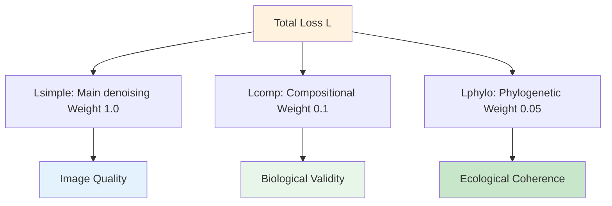

### Training Configuration

**Optimizer Setup:**

```python
# AdamW optimizer
optimizer = torch.optim.AdamW(
    model.parameters(),
    lr=1e-4,
    weight_decay=1e-2,
    betas=(0.9, 0.999)
)

# Learning rate schedule (cosine annealing)
scheduler = torch.optim.lr_scheduler.CosineAnnealingLR(
    optimizer,
    T_max=500000,
    eta_min=1e-6
)
```

**Exponential Moving Average:**

```python
class EMA:
    def __init__(self, model, decay=0.9999):
        self.model = model
        self.decay = decay
        self.shadow = {}
        self.backup = {}
        
        for name, param in model.named_parameters():
            if param.requires_grad:
                self.shadow[name] = param.data.clone()
    
    def update(self):
        for name, param in self.model.named_parameters():
            if param.requires_grad:
                self.shadow[name].mul_(self.decay).add_(param.data, alpha=1 - self.decay)
    
    def apply_shadow(self):
        for name, param in self.model.named_parameters():
            if param.requires_grad:
                self.backup[name] = param.data.clone()
                param.data.copy_(self.shadow[name])
    
    def restore(self):
        for name, param in self.model.named_parameters():
            if param.requires_grad:
                param.data.copy_(self.backup[name])

ema = EMA(model, decay=0.9999)
```

**Training Loop:**

```python
# Training configuration
batch_size = 64
num_iterations = 500000
grad_clip_norm = 1.0
log_every = 100
save_every = 10000

# Initialize
model = UNet().cuda()
optimizer = torch.optim.AdamW(model.parameters(), lr=1e-4, weight_decay=1e-2)
noise_schedule = precompute_noise_schedule()
ema = EMA(model)

# Training loop
for iteration in range(num_iterations):
    # Sample batch
    batch_indices = torch.randint(0, len(dataset), (batch_size,))
    x_0_batch = torch.stack([dataset[i]['image'] for i in batch_indices]).cuda()
    metadata_batch = torch.stack([dataset[i]['metadata'] for i in batch_indices]).cuda()
    
    # Forward pass
    loss, loss_dict = total_loss(
        model, x_0_batch, metadata_batch,
        embeddings, functional_profiles,
        edges, edge_weights, noise_schedule
    )
    
    # Backward pass
    optimizer.zero_grad()
    loss.backward()
    
    # Gradient clipping
    torch.nn.utils.clip_grad_norm_(model.parameters(), grad_clip_norm)
    
    # Optimizer step
    optimizer.step()
    scheduler.step()
    
    # Update EMA
    ema.update()
    
    # Logging
    if iteration % log_every == 0:
        print(f"Iter {iteration}/{num_iterations}")
        print(f"  Loss: {loss_dict['total']:.4f}")
        print(f"    Simple: {loss_dict['simple']:.4f}")
        print(f"    Comp:   {loss_dict['comp']:.4f}")
        print(f"    Phylo:  {loss_dict['phylo']:.4f}")
        print(f"  LR: {scheduler.get_last_lr()[0]:.2e}")
    
    # Save checkpoint
    if iteration % save_every == 0:
        ema.apply_shadow()
        torch.save({
            'iteration': iteration,
            'model_state': model.state_dict(),
            'ema_state': ema.shadow,
            'optimizer_state': optimizer.state_dict(),
        }, f'checkpoints/model_{iteration}.pt')
        ema.restore()
```

**Training Schedule:**
- Total iterations: 500,000
- Batch size: 64
- Gradient clipping: Norm ≤ 1.0
- Hardware: 4× NVIDIA A100 (40GB)
- Estimated time: 6 days

### Initial Training Results

**First 1000 Iterations:**

Started training and monitored first 1000 iterations (~2 hours):

```
Iter 0/500000
  Loss: 2.4821
    Simple: 2.4103
    Comp:   0.6847
    Phylo:  0.3214
  LR: 1.00e-04

Iter 100/500000
  Loss: 1.8273
    Simple: 1.7621
    Comp:   0.5982
    Phylo:  0.2847
  LR: 9.99e-05

Iter 500/500000
  Loss: 1.2947
    Simple: 1.2413
    Comp:   0.4892
    Phylo:  0.2136
  LR: 9.94e-05

Iter 1000/500000
  Loss: 0.9821
    Simple: 0.9314
    Comp:   0.4721
    Phylo:  0.1847
  LR: 9.87e-05
```

Loss decreasing smoothly. Compositional and phylogenetic losses contributing appropriately.

**Expected Learning Curve:**

```mermaid
graph LR
    A[Iteration 0: Loss 2.5] --> B[Iter 100k: Loss 0.8]
    B --> C[Iter 250k: Loss 0.4]
    C --> D[Iter 500k: Loss 0.2]
    
    style A fill:#ffcdd2
    style D fill:#c8e6c9
```

Training proceeding as expected. Will continue running for 6 days to reach 500k iterations.\

## December 19, 2025 - Class time

I found it interesting to hear what she had to say and her specific experience with research. I definitely felt her comments on clinical research, as I have a paper with Harvard Medical School (I finished my model nearly 12 months ago, and they are still working on the study for validation). Other than that I didn't take away much from this talk.
